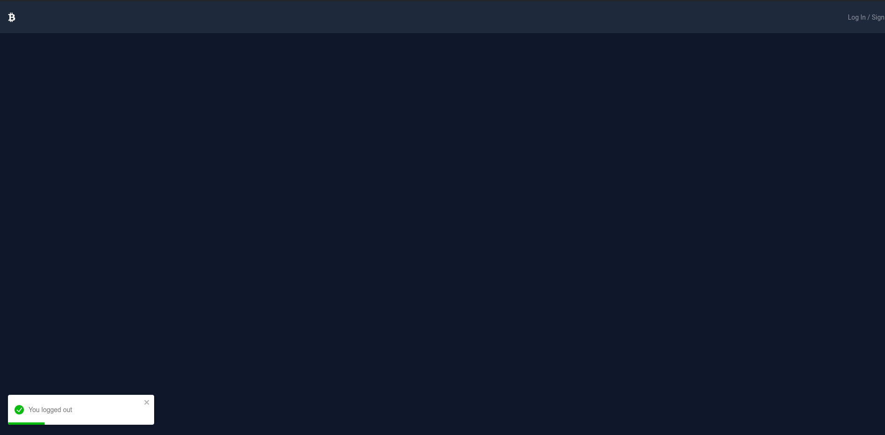
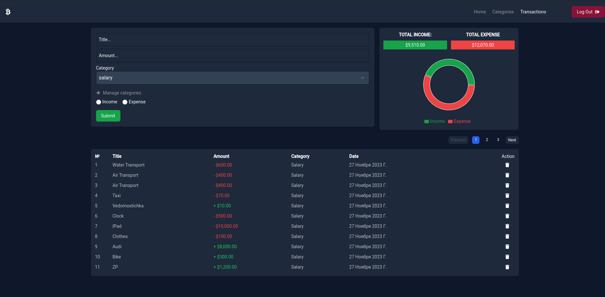
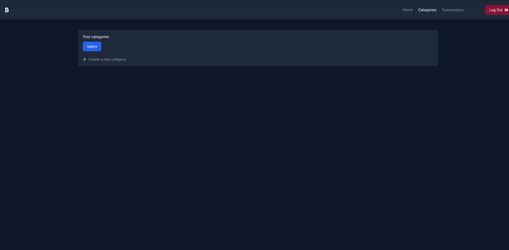
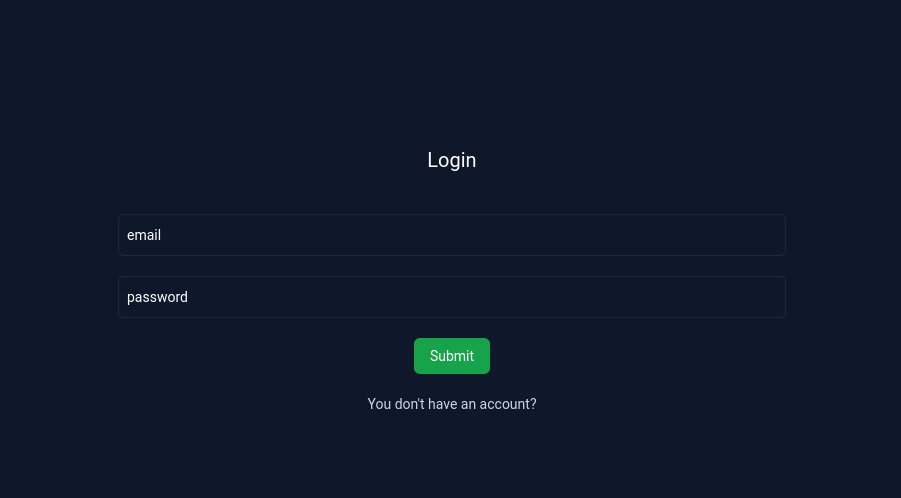
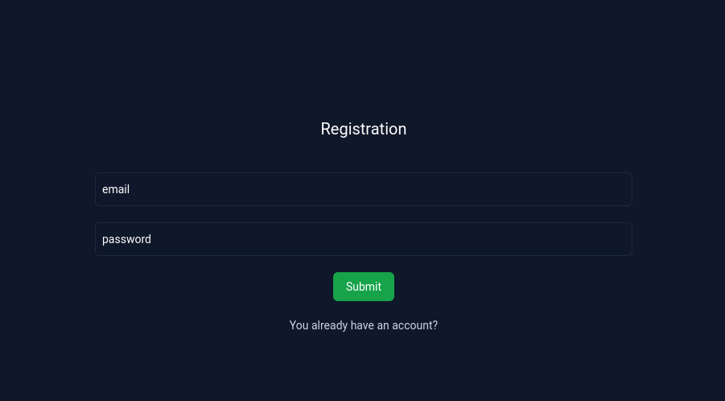
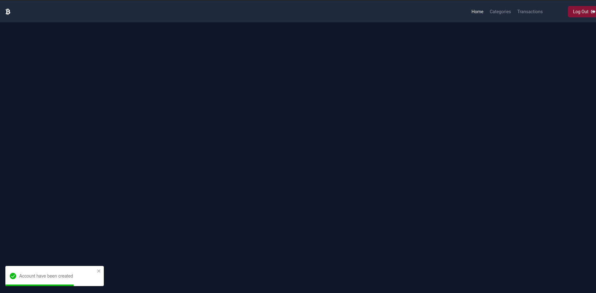
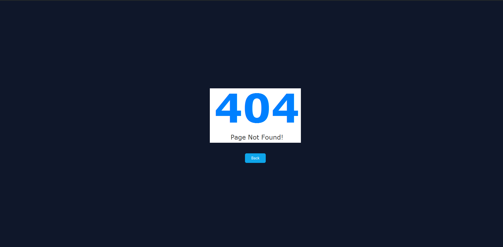

# Finance Manager

Ths is simple online finance manager.

## Tech stack

<div>
    <h4>Backend:</h4>
    <ul>
        <li>
            <a href="https://nestjs.com/">Nest JS</a>
        </li>
        <li>
            <a href="https://www.postgresql.org/">PostgreSQL</a>
        </li>
        <li>
            <a href="https://jwt.io/">JWT</a>
        </li>
    </ul>
    <h4>Frontend:</h4>
    <ul>
        <li>
            <a href="https://react.dev/">React</a> TypeScript
        </li>
        <li>
            <a href="https://redux.js.org/">Redux Toolkit</a>
        </li>
        <li>
            <a href="https://tailwindcss.com/">TailwindCSS</a>
        </li>
    </ul>
</div>

## Startup guide

To run the application you should go to the server and client folders where you need to run this command to install the necessary packages:
```
npm install
```

Starting the server:
```
npm run start
```
or:
```
nest start
```
Starting the client:
```
npm run dev
```

## Functionality

### Home page

If you are not logged in, you will see this when you launch the application:

</img>


### Transactions page

Here you can see information about your income/expenses. You can also add and remove them:

</img>


### Categories page

On this page you can create your own categories for income/expenses:

</img>


### Authorization

Registration/login forms look like this:

<div style="display:flex;gap:10px;">
    </img>
    </img>
</div>

After registration/login you will see this page:

</img>


### Error page

If you enter a non-existent path in the browser line, you will be taken to this page:

</img>
